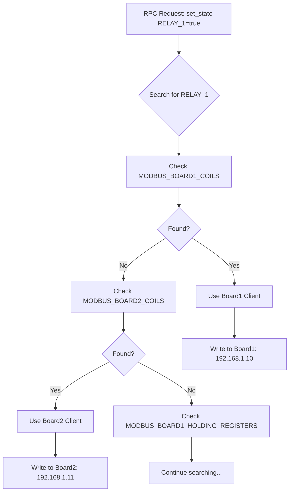

# VIIS RPC Control Node - Multi-Board Support & Auto-Detection

## Overview

The VIIS RPC Control Node provides intelligent multi-board support with **AUTOMATIC BOARD DETECTION**. Unlike other nodes that require manual board selection, this node automatically determines which Modbus board to communicate with based on the parameter key names.

## How Auto-Detection Works

### Single-Board Mode (Backward Compatible)
When `MODBUS_BOARDS` is not configured, the system operates in traditional single-board mode:
```env
MODBUS_HOST=192.168.1.10
MODBUS_TCP_PORT=502
MODBUS_COILS={"RELAY_1":0,"PUMP_1":1}
MODBUS_HOLDING_REGISTERS={"TEMP_SETPOINT":0,"PRESSURE_SETPOINT":1}
```

### Multi-Board Mode with Auto-Detection

When `MODBUS_BOARDS` is configured, the system enables intelligent auto-detection:

#### Configuration
```env
# Define multiple boards
MODBUS_BOARDS=[{"id":"board1","name":"Main Controller","host":"192.168.1.10","tcpPort":502},{"id":"board2","name":"Sensor Board","host":"192.168.1.11","tcpPort":502}]
MODBUS_DEFAULT_BOARD=board1

# Define board-specific mappings
MODBUS_BOARD1_COILS={"RELAY_1":0,"RELAY_2":1,"PUMP_MAIN":2}
MODBUS_BOARD1_HOLDING_REGISTERS={"TEMP_SETPOINT":0,"PRESSURE_SETPOINT":1}

MODBUS_BOARD2_COILS={"VALVE_1":0,"VALVE_2":1,"PUMP_AUX":2}
MODBUS_BOARD2_HOLDING_REGISTERS={"FLOW_RATE":0,"LEVEL_SETPOINT":1}
```

#### Auto-Detection Process



## Usage Examples

### Example 1: Control Different Boards Automatically

```javascript
// RPC Request 1 - Automatically goes to Board1
msg.payload = {
    method: "set_state",
    params: {
        "RELAY_1": true,        // Found in BOARD1_COILS → Board1
        "TEMP_SETPOINT": 25     // Found in BOARD1_HOLDING → Board1
    }
};

// RPC Request 2 - Automatically goes to Board2
msg.payload = {
    method: "set_state",
    params: {
        "VALVE_1": true,        // Found in BOARD2_COILS → Board2
        "FLOW_RATE": 100        // Found in BOARD2_HOLDING → Board2
    }
};

// Mixed Request - Automatically routes to correct boards
msg.payload = {
    method: "set_state",
    params: {
        "RELAY_1": true,        // → Board1
        "VALVE_1": false,       // → Board2
        "PUMP_MAIN": true,      // → Board1
        "LEVEL_SETPOINT": 50    // → Board2
    }
};
```

### Example 2: Luoi Pattern with Auto-Detection

```javascript
// Control irrigation zones on different boards
msg.payload = {
    method: "set_state",
    params: {
        "luoi_1": 15,  // Zone 1 (Board1) - irrigate for 15 minutes
        "luoi_2": 20,  // Zone 2 (Board1) - irrigate for 20 minutes
        "luoi_5": 10   // Zone 5 (Board2) - irrigate for 10 minutes
    }
};
```

## Benefits of Auto-Detection

### 1. **Zero Configuration Complexity**
- No need to specify board IDs in RPC requests
- No need to remember which parameter belongs to which board
- System automatically routes to correct board

### 2. **Seamless Migration**
- Move parameters between boards by updating env mappings
- No code changes required
- No flow modifications needed

### 3. **Simplified High-Level Control**
```javascript
// You write this (simple, board-agnostic)
params: { "RELAY_1": true }

// System automatically handles this (complex routing)
// 1. Detect RELAY_1 belongs to board1
// 2. Get board1 client (192.168.1.10:502)
// 3. Write to correct address
// 4. Handle connection pooling
```

## Comparison with viis-modbus-getter

| Feature | viis-rpc-control | viis-modbus-getter |
|---------|------------------|-------------------|
| **Purpose** | High-level control (WHAT) | Low-level access (WHERE) |
| **Input** | Parameter names | Raw addresses |
| **Board Selection** | **Automatic** via key mapping | Manual via boardId |
| **Example Input** | `"RELAY_1": true` | `{address: 0, boardId: "board1"}` |
| **Use Case** | Application logic | Direct hardware access |

## Hot-Reload Support

Configuration changes are detected automatically:

1. **Edit env file**: Change board mappings or add new parameters
2. **Wait ~40 seconds**: System detects changes
3. **Auto-reload**: New mappings active without restart

```bash
# Before
MODBUS_BOARD1_COILS={"RELAY_1":0}

# After (move RELAY_1 to board2)
MODBUS_BOARD1_COILS={}
MODBUS_BOARD2_COILS={"RELAY_1":0}

# Result: RELAY_1 now automatically routes to board2
```

## Debug & Monitoring

Enable detailed logging to see auto-detection in action:

```
[AUTO-DETECT] Key "RELAY_1" → Board: board1 (Address: 0)
[GET-CLIENT] Getting Modbus client for board: board1
[MODBUS-MULTI] Node xyz got board board1 client, ref count: 2
[WRITE] Executing Modbus write: board=board1, address=0, value=true
```

## Configuration Best Practices

### 1. **Organize by Function**
```env
# Board1: Main control systems
MODBUS_BOARD1_COILS={"SYSTEM_ENABLE":0,"MAIN_PUMP":1,"HEATER":2}

# Board2: Sensor inputs
MODBUS_BOARD2_INPUT_REGISTERS={"TEMP_1":0,"HUMIDITY_1":1,"PRESSURE_1":2}

# Board3: Actuators
MODBUS_BOARD3_COILS={"VALVE_1":0,"VALVE_2":1,"VALVE_3":2}
```

### 2. **Use Descriptive Names**
```env
# Good: Clear what each parameter controls
MODBUS_BOARD1_COILS={"GREENHOUSE_PUMP":0,"GREENHOUSE_FAN":1}

# Bad: Unclear naming
MODBUS_BOARD1_COILS={"P1":0,"F1":1}
```

### 3. **Document Board Purpose**
```env
# Board 1: Main Controller - Handles primary system functions
# Board 2: Environmental Sensors - Temperature, humidity, CO2
# Board 3: Irrigation Control - Valves, pumps, flow meters
```

## Troubleshooting

### Issue: Parameter not found
**Symptom**: `Key "UNKNOWN_KEY" not found in any board mapping`

**Solution**: 
1. Check spelling of parameter name
2. Verify parameter exists in board mappings
3. Check env file loaded correctly

### Issue: Wrong board selected
**Symptom**: Parameter writes to unexpected board

**Solution**:
1. Check for duplicate parameter names across boards
2. Verify env file syntax is correct
3. Wait for hot-reload after changes (40s)

### Issue: Connection failures
**Symptom**: `Failed to get client for board boardX`

**Solution**:
1. Verify board IP and port are correct
2. Check network connectivity
3. Ensure Modbus device is powered on

## Advanced Features

### Dynamic Parameter Discovery

The system can report all available parameters:

```javascript
// Get all available parameters and their boards
const mappings = modbusService.getAllMappings();
// Returns: {
//   "RELAY_1": { board: "board1", type: "coil", address: 0 },
//   "TEMP_SETPOINT": { board: "board1", type: "holding", address: 0 },
//   "VALVE_1": { board: "board2", type: "coil", address: 0 }
// }
```

### Board Health Monitoring

Each board connection is monitored independently:
- Connection status per board
- Reference counting per board
- Automatic reconnection on failure
- Connection pooling for efficiency

## Summary

The VIIS RPC Control Node's auto-detection feature provides:
- ✅ **Zero-configuration** board routing
- ✅ **Automatic** parameter-to-board mapping
- ✅ **Seamless** multi-board control
- ✅ **Hot-reload** configuration updates
- ✅ **Backward** compatible with single-board setups

This design allows you to focus on WHAT you want to control, not WHERE it's located!
