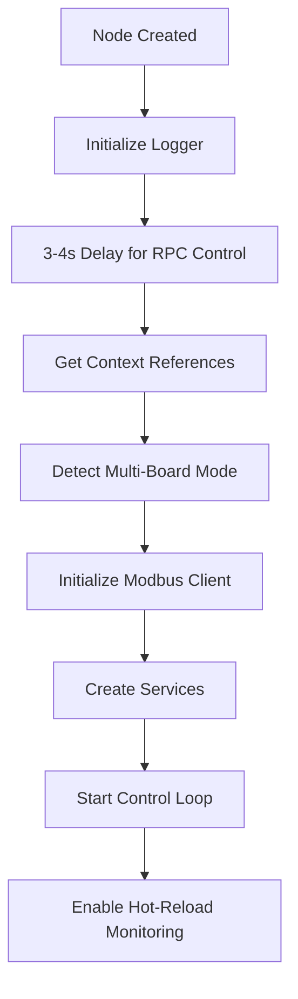
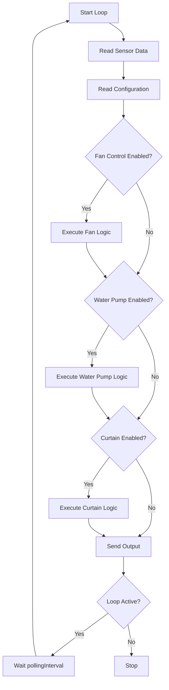

# VIIS Auto Microclimate Control Node - Logic Documentation

## Overview

The `viis-auto-microclimate-control` node is a custom Node-RED node that provides **automatic environmental control** for greenhouse systems. It monitors sensor data (temperature, humidity, light) and automatically controls fans, water pumps, and curtains based on configurable thresholds and modes.

---

## Node Configuration

### Basic Properties

| Property | Type | Default | Description |
|----------|------|---------|-------------|
| `name` | String | `""` | Node name |
| `pollingInterval` | Number | `10000` | Control cycle interval in milliseconds (min: 1000ms) |
| `enableFanControl` | Boolean | `true` | Enable/disable fan control *(UI only, not yet implemented in logic)* |
| `enableWaterPumpControl` | Boolean | `true` | Enable/disable water pump control *(UI only, not yet implemented in logic)* |
| `enableCurtainControl` | Boolean | `true` | Enable/disable curtain control *(UI only, not yet implemented in logic)* |

### Example Node Configuration

```json
{
    "id": "798a8e7d096714a6",
    "type": "viis-auto-microclimate-control",
    "z": "547ba825d69085e6",
    "name": "",
    "pollingInterval": 10000,
    "enableFanControl": true,
    "enableWaterPumpControl": true,
    "enableCurtainControl": true,
    "x": 290,
    "y": 720,
    "wires": [
        [
            "804a567bc109bcfa"
        ]
    ]
}
```

---

## Architecture

### Service Components

```
viis-auto-microclimate-control/
├── viis-auto-microclimate-control.ts    # Main node implementation
├── viis-auto-microclimate-control.html  # Node-RED UI configuration
├── interfaces/
│   └── types.ts                         # TypeScript interfaces
├── handlers/
│   └── autoControlHandler.ts            # Main control loop handler
├── services/
│   ├── configService.ts                 # Configuration management
│   ├── sensorService.ts                 # Sensor data reading
│   ├── modbusService.ts                 # Modbus communication
│   ├── fanControlService.ts             # Fan control logic
│   ├── enhancedFanControlService.ts     # Advanced fan features
│   ├── waterPumpControlService.ts       # Water pump logic
│   └── curtainControlService.ts         # Curtain control logic
├── utils/
│   ├── logger.ts                        # Logging utility
│   └── groupUtils.ts                    # Fan group utilities
└── constants/
    └── index.ts                         # Configuration constants
```

### Initialization Flow



---

## Control Logic

### 1. Fan Control

#### Operating Modes

**Threshold Mode** (`set_auto_mode_fan = 0`):
- Fans activate based on temperature thresholds K1-K4
- Each threshold corresponds to a different fan activation level

**Rotation Mode** (`set_auto_mode_fan = 1`):
- Fan groups rotate at specified intervals
- Prevents wear on individual fans
- Group size configured via `set_gr_alternate_fan`

#### Temperature Thresholds

| Threshold | Key | Description |
|-----------|-----|-------------|
| K1 | `set_k1_fan` | Lowest temperature threshold |
| K2 | `set_k2_fan` | Medium-low temperature threshold |
| K3 | `set_k3_fan` | Medium-high temperature threshold |
| K4 | `set_k4_fan` | Highest priority - activates all fans |

#### Configuration Keys

```javascript
{
    "set_mode_fan": 1,              // Enable fan control (0=off, 1=on)
    "set_auto_mode_fan": 0,         // 0=threshold, 1=rotation
    "set_k1_fan": 25,               // Temperature threshold K1 (°C)
    "set_k2_fan": 28,               // Temperature threshold K2 (°C)
    "set_k3_fan": 31,               // Temperature threshold K3 (°C)
    "set_k4_fan": 35,               // Temperature threshold K4 (°C)
    "set_gr_alternate_fan": 2,      // Group size (1, 2, 4, 6)
    "set_time_alternate_fan": 30    // Rotation interval (minutes)
}
```

---

### 2. Water Pump Control

#### Control Logic

The water pump activates based on humidity thresholds:

- **Activate**: When humidity < `set_threshold_low_water_bump`
- **Deactivate**: When humidity > `set_threshold_high_water_bump`
- **K4 Override**: Pump activates during extreme conditions

#### Configuration Keys

```javascript
{
    "set_mode_tuong_nuoc": 1,              // Enable water pump (0=off, 1=on)
    "set_threshold_low_water_bump": 60,    // Low humidity threshold (%)
    "set_threshold_high_water_bump": 80    // High humidity threshold (%)
}
```

---

### 3. Curtain Control

#### Control Logic

Each curtain (`luoi 1` and `luoi 2`) has two coils:
- **Thu coil**: Retracts the curtain
- **Dai coil**: Extends the curtain

#### Light Thresholds

| Action | Condition |
|--------|-----------|
| **Extend (dai)** | Outdoor light ≥ `set_light_dai_luoi_X` |
| **Retract (thu)** | Outdoor light ≤ `set_light_thu_luoi_X` |
| **Retract (indoor)** | Indoor light ≤ `set_light_indoor_thu_luoi_X` |

#### Tolerance Timer

Prevents rapid switching when light levels fluctuate near thresholds:
- Configured via `set_tolerance_light_luoi_X` (minutes)
- Only one coil can be active at a time per curtain

#### Configuration Keys

```javascript
{
    "set_mode_luoi": 1,                        // Enable curtain control (0=off, 1=on)
    "set_light_dai_luoi_1": 5000,              // Extend threshold (lux)
    "set_light_thu_luoi_1": 2000,              // Retract threshold (lux)
    "set_light_indoor_thu_luoi_1": 1000,       // Indoor retract threshold (lux)
    "set_tolerance_light_luoi_1": 10,          // Tolerance time (minutes)
    "set_light_dai_luoi_2": 5000,
    "set_light_thu_luoi_2": 2000,
    "set_light_indoor_thu_luoi_2": 1000,
    "set_tolerance_light_luoi_2": 10
}
```

---

## Input Commands

Send commands to control the node programmatically:

```javascript
{
    "payload": {
        "command": "start|stop|execute|status|updateInterval",
        "params": { /* optional parameters */ }
    }
}
```

### Available Commands

| Command | Description | Parameters |
|---------|-------------|------------|
| `start` | Start the control loop | None |
| `stop` | Stop the control loop | None |
| `execute` | Execute one control cycle manually | None |
| `status` | Get current control status | None |
| `updateInterval` | Change polling interval | `{ interval: 5000 }` |

---

## Output Format

The node outputs control execution results:

```javascript
{
    "payload": {
        "timestamp": 1234567890,
        "success": true,
        "actionsExecuted": 3,
        "errors": 0,
        "sensorData": {
            "temperature": 28.5,
            "humidity": 65,
            "light": 3500
        },
        "controlStatus": {
            "fans": { "active": true, "mode": "threshold" },
            "waterPump": { "active": false },
            "curtains": { "luoi1": "extended", "luoi2": "retracted" }
        },
        "actions": [
            { "device": "fan_1", "action": "on", "reason": "temperature > K2" }
        ]
    }
}
```

---

## Multi-Board Support

### Detection

The node automatically detects multi-board mode by checking for the `MODBUS_BOARDS` environment variable.

### Configuration

```javascript
// Single-board mode
MODBUS_TYPE=TCP
MODBUS_HOST=192.168.1.100
MODBUS_TCP_PORT=502
MODBUS_UNIT_ID=1

// Multi-board mode
MODBUS_BOARDS=[
    {"id": "board1", "host": "192.168.1.101", "unitId": 1},
    {"id": "board2", "host": "192.168.1.102", "unitId": 1}
]
MODBUS_DEFAULT_BOARD=board1
```

### Hot-Reload

The node monitors configuration changes every **30 seconds** and automatically:
- Detects mode changes (single ↔ multi)
- Reloads Modbus configuration
- Reinitializes clients without restart

---

## Environment Variables

### Required Variables

| Variable | Description | Default |
|----------|-------------|---------|
| `MODBUS_TYPE` | Connection type (TCP/RTU) | `TCP` |
| `MODBUS_HOST` | Modbus server host | `localhost` |
| `MODBUS_TCP_PORT` | TCP port | `502` |
| `MODBUS_UNIT_ID` | Modbus unit ID | `1` |
| `MODBUS_COILS` | JSON mapping of coils | `{}` |
| `MODBUS_HOLDING_REGISTERS` | JSON mapping of registers | `{}` |

### Global Context Variables

The node reads from global context:
- `configKeyValues`: Configuration key-value pairs
- `holdingRegisterData`: Sensor data (temperature, humidity, light)
- `coilRegisterData`: Device status

---

## Control Loop

### Execution Flow



### Polling Interval

- **Default**: 10,000ms (10 seconds)
- **Minimum**: 1,000ms (1 second)
- **Recommended**: 5,000-30,000ms for stable operation

---

## Error Handling

### Status Indicators

| Status | Color | Shape | Description |
|--------|-------|-------|-------------|
| Initializing | Yellow | Ring | Node is starting up |
| Ready | Green | Dot | Normal operation |
| Error | Red | Ring | Critical error occurred |
| Reloading | Blue | Dot | Configuration reload in progress |

### Common Errors

- **Modbus Client Failure**: Cannot connect to Modbus server
- **Configuration Error**: Invalid configuration values
- **Sensor Read Error**: Unable to read sensor data
- **Control Logic Error**: Error during control execution

---

## Best Practices

### 1. Threshold Configuration

- Set K1-K4 with at least 2-3°C separation to prevent oscillation
- Use rotation mode for even wear distribution
- Configure appropriate group sizes based on total fan count

### 2. Water Pump Hysteresis

- Set low/high thresholds with 10-20% gap to prevent rapid cycling
- Example: Low=60%, High=80%

### 3. Curtain Tolerance

- Use 5-15 minute tolerance to handle cloud cover fluctuations
- Higher tolerance = more stable but slower response

### 4. Polling Interval

- Shorter intervals = faster response but more Modbus traffic
- Longer intervals = more stable but slower response
- Recommended: 10-15 seconds for most applications

---

## Example Flow

```json
[
    {
        "id": "798a8e7d096714a6",
        "type": "viis-auto-microclimate-control",
        "z": "547ba825d69085e6",
        "name": "Greenhouse Auto Control",
        "pollingInterval": 10000,
        "enableFanControl": true,
        "enableWaterPumpControl": true,
        "enableCurtainControl": true,
        "x": 290,
        "y": 720,
        "wires": [
            [
                "804a567bc109bcfa"
            ]
        ]
    },
    {
        "id": "804a567bc109bcfa",
        "type": "debug",
        "z": "547ba825d69085e6",
        "name": "Control Output",
        "active": true,
        "tosidebar": true,
        "console": false,
        "tostatus": false,
        "complete": "payload",
        "x": 520,
        "y": 720,
        "wires": []
    }
]
```

---

## Testing & Debugging

### Enable Debug Logging

The node uses internal logging. Check Node-RED debug panel for:
- `[AUTO-CONTROL-INIT]` - Initialization messages
- `[HOT-RELOAD]` - Configuration change messages
- `[CLEANUP]` - Shutdown messages

### Manual Control Cycle

Send this message to trigger immediate execution:

```javascript
{
    "payload": {
        "command": "execute"
    }
}
```

### Check Status

```javascript
{
    "payload": {
        "command": "status"
    }
}
```

---

## Related Documentation

- [Multi-Board Support Guide](../../../docs/multi-board-support/README.md)
- [Modbus RTU Setup Guide](../../../docs/MODBUS_RTU_SETUP_GUIDE.md)
- [Error & Warning Management Architecture](../docs/ERROR_WARNING_MANAGEMENT_ARCHITECTURE.md)

---

## Version Information

- **Module Path**: `services/nodered/custom-nodes/viis-node-red/src/modules/viis-auto-microclimate-control/`
- **Node Type**: `viis-auto-microclimate-control`
- **Category**: VIIS
- **Color**: `#BBD8A3` (Light Green)

---

*Last updated: 2026-04-09*
