# VIIS Schedule Executor - Architecture Diagrams

## System Context Diagram

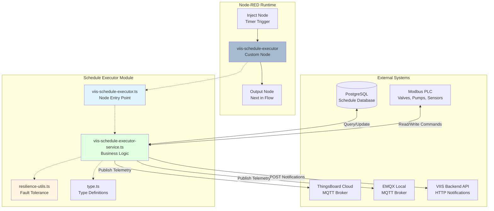

## Component Interaction Diagram

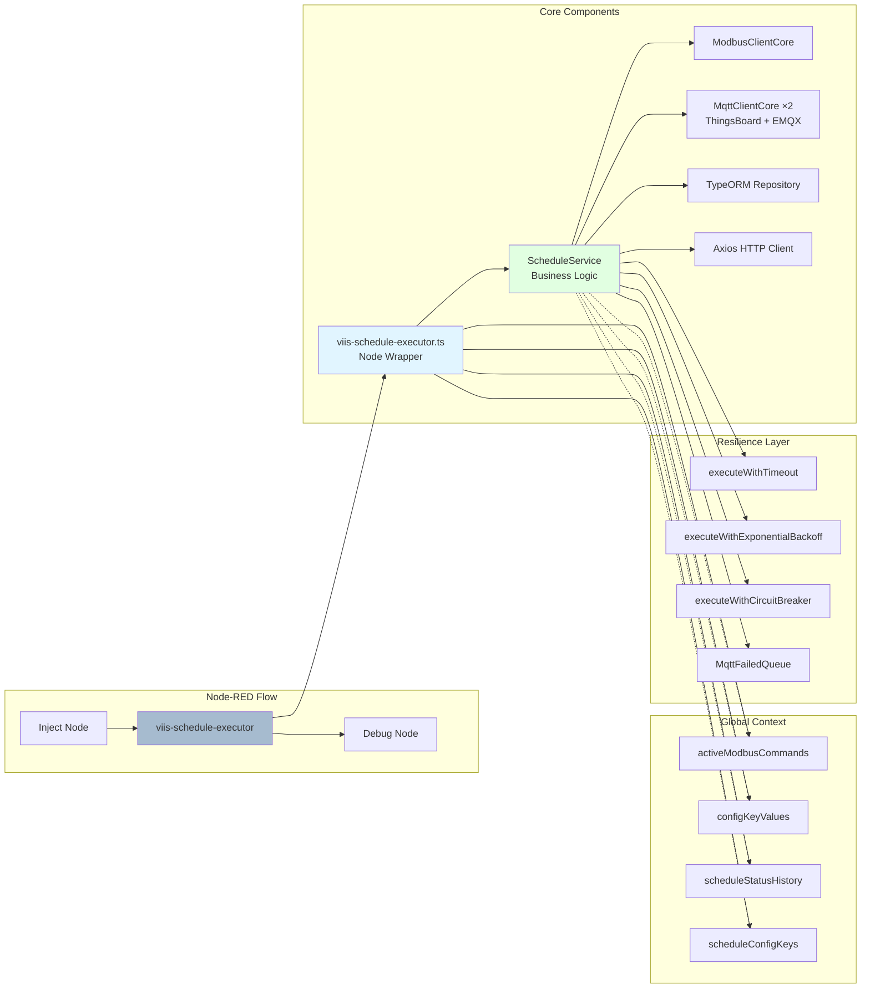

## Schedule Execution State Machine

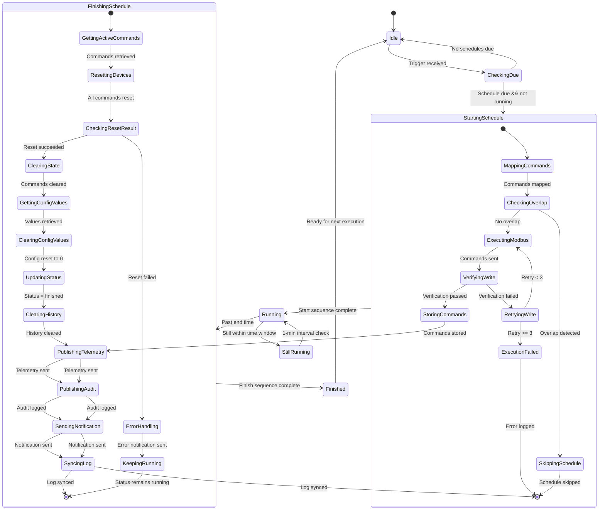

## Message Routing Logic

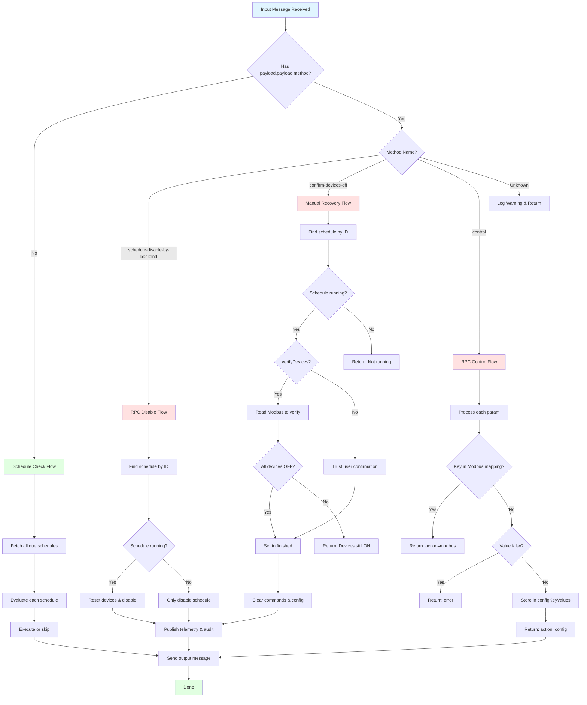

## Modbus Command Execution Sequence

```mermaid
sequenceDiagram
    participant Node as Schedule Executor
    participant Service as ScheduleService
    participant Modbus as Modbus Device
    participant Verify as Verification Logic
    
    Note over Node,Verify: START SEQUENCE
    
    Node->>Service: mapScheduleToModbus(schedule)
    Service->>Service: Parse action JSON
    Service->>Service: Add iri_time if missing
    Service->>Service: Normalize string numbers
    
    loop For each key in action
        alt Key in holding registers
            Service->>Service: Create FC=6 command
        else Key in coils
            Service->>Service: Create FC=5 command
        else Key not mapped && not falsy
            Service->>Service: Store as config parameter
        else Key not mapped && falsy
            Note over Service: Skip key
        end
    end
    
    Service-->>Node: holdingCommands, coilCommands, configParams
    
    Node->>Node: Add reset keys<br/>(time_valve_*, set_flow_* not in action)
    
    Node->>Service: canExecuteCommands()
    Service->>Service: Check overlap with activeModbusCommands
    
    alt No overlap
        Service-->>Node: true
        
        Node->>Service: executeModbusCommands()
        
        Note over Service,Modbus: Phase 1: Holding Registers
        loop For each holding command
            Service->>Modbus: writeRegister(address, scaled_value)
            Modbus-->>Service: Acknowledge
            Service->>Service: Delay 100ms
        end
        
        Note over Service,Modbus: Phase 2: Valve Coils
        loop For each valve coil
            Service->>Modbus: writeCoil(address, value)
            Modbus-->>Service: Acknowledge
            Service->>Service: Delay 100ms
        end
        
        Note over Service,Modbus: Phase 3: Other Coils
        loop For each other coil
            Service->>Modbus: writeCoil(address, value)
            Modbus-->>Service: Acknowledge
            Service->>Service: Delay 100ms
        end
        
        Note over Service: DELAY 5 SECONDS
        Service->>Service: await delay(5000)
        
        Note over Service,Modbus: Phase 4: Control Coils (Pump/Power)
        loop For each control coil
            Service->>Modbus: writeCoil(address, value)
            Modbus-->>Service: Acknowledge
            Service->>Service: Delay 100ms
        end
        
        Note over Service,Verify: VERIFICATION PHASE
        
        Node->>Service: verifyModbusWrite()
        
        loop For each command to verify
            alt FC=5 (Coil - Always verified)
                Service->>Modbus: readCoils(address, 1)
                Modbus-->>Service: Return value
            else FC=6 (Holding - If verifyAfterWrite)
                Service->>Modbus: readHoldingRegisters(address, 1)
                Modbus-->>Service: Return raw value
                Service->>Service: Scale value (read direction)
            end
            
            Service->>Service: Compare with expected
            alt Value matches
                Note over Service: Verification OK
            else Value mismatch
                Service-->>Node: false
                Note over Node: Retry or fail
            end
        end
        
        Service-->>Node: true (all verified)
        
        Node->>Service: storeActiveCommands()
        Service->>Service: Save to activeModbusCommands
        
    else Overlap detected
        Service-->>Node: false
        Note over Node: Skip execution
    end
    
    Note over Node,Verify: Finish sequence follows reverse order
```

## Configuration Parameter Lifecycle

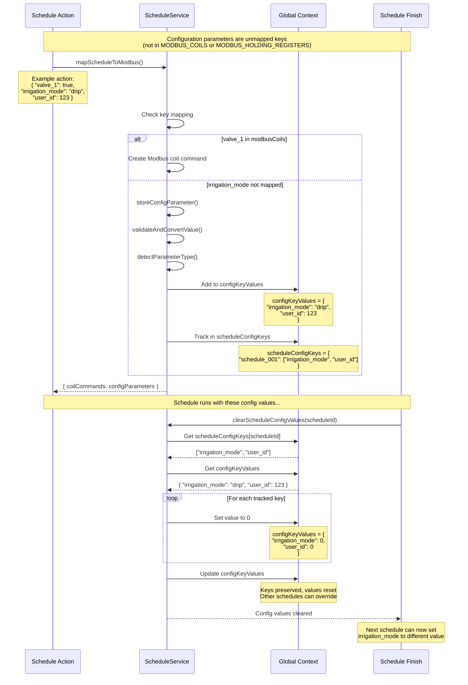

## RPC Command Processing

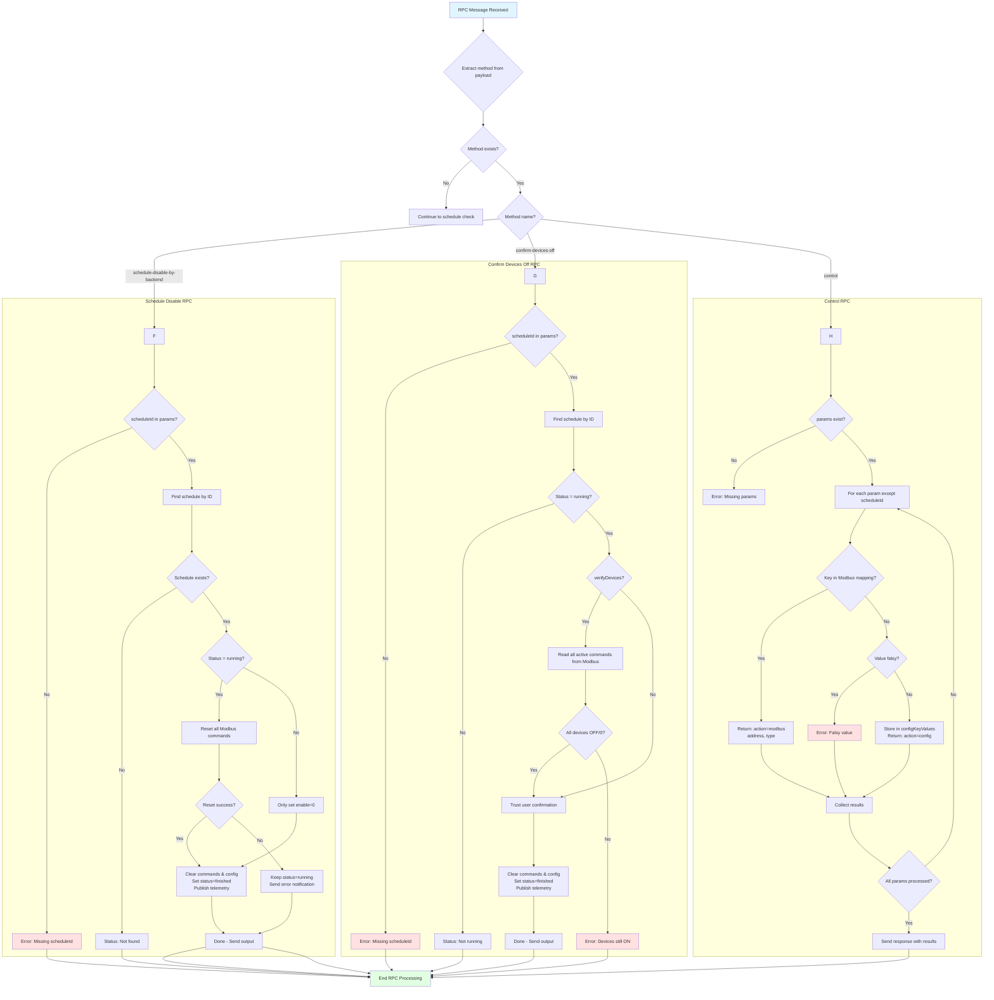

## Error Recovery Strategies

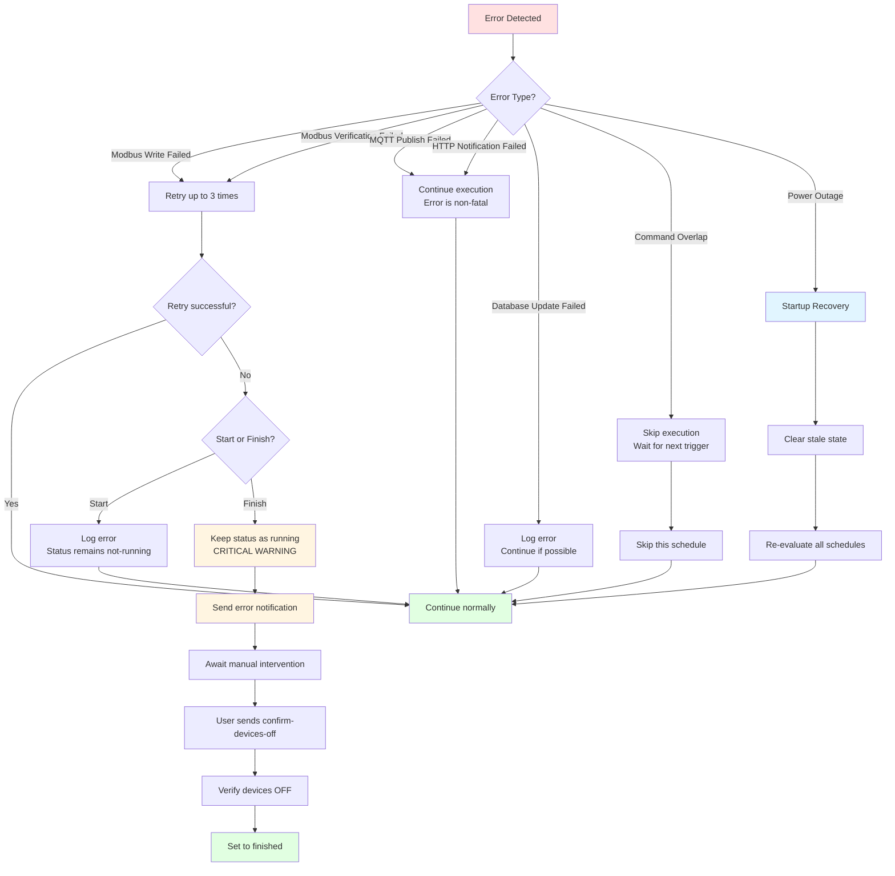

## Global Context Data Flow

```mermaid
graph TB
    subgraph "Write Operations"
        A1[Schedule Start] -->|Write| AC[activeModbusCommands]
        A2[Schedule Finish] -->|Clear| AC
        A3[RPC Disable] -->|Clear| AC
        A4[Manual Recovery] -->|Clear| AC
        
        B1[Config Parameter] -->|Write| CV[configKeyValues]
        B2[RPC Control] -->|Write| CV
        B3[Schedule Finish] -->|Reset to 0| CV
        
        C1[Status Change] -->|Write| SH[scheduleStatusHistory]
        C2[Schedule Finish] -->|Clear| SH
        C3[Cleanup] -->|Clean stale| SH
        
        D1[Schedule Start] -->|Write| CK[scheduleConfigKeys]
        D2[Config Parameter] -->|Append| CK
    end
    
    subgraph "Read Operations"
        E1[Overlap Check] -->|Read| AC
        E2[Finish Sequence] -->|Read| AC
        E3[Verify Devices] -->|Read| AC
        
        F1[Finish Telemetry] -->|Read| CV
        F2[RPC Disable Telemetry] -->|Read| CV
        F3[Manual Recovery Telemetry] -->|Read| CV
        
        G1[Status Change Detection] -->|Read| SH
        G2[Cleanup Check] -->|Read| SH
        
        H1[Clear Config Values] -->|Read| CK
    end
    
    subgraph "Deduplication Tracking"
        I1[Telemetry Publish] -->|Write| TL[telemetryLastPublished_*]
        I2[Telemetry Check] -->|Read| TL
    end
    
    style AC fill:#e1f5ff
    style CV fill:#fff5e1
    style SH fill:#e1ffe1
    style CK fill:#fff5e1
    style TL fill:#e1f5ff
```

## Startup Recovery Flow

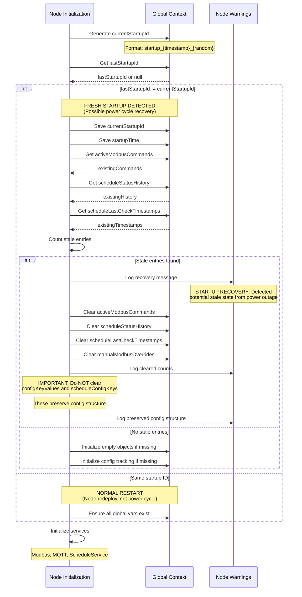

## Telemetry Publishing Flow

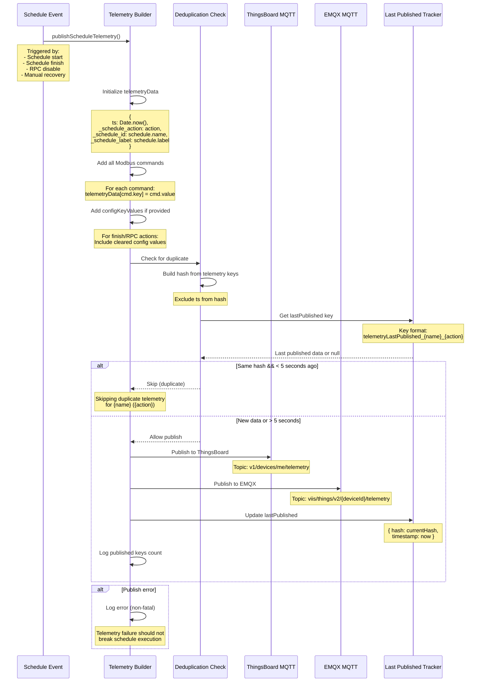

## Circuit Breaker State Transitions

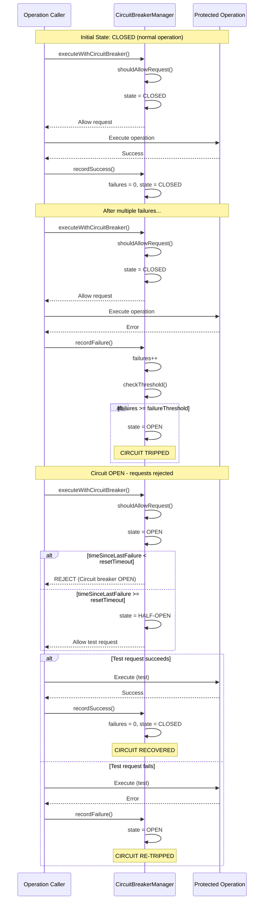

---

*Architecture diagrams generated on April 13, 2026*
