# VIIS Schedule Executor - Complete Flow Documentation

## Table of Contents
- [Overview](#overview)
- [Architecture](#architecture)
- [Core Components](#core-components)
- [Main Execution Flow](#main-execution-flow)
- [Schedule Lifecycle](#schedule-lifecycle)
- [Modbus Command Execution](#modbus-command-execution)
- [MQTT Telemetry & Audit](#mqtt-telemetry--audit)
- [RPC Control Commands](#rpc-control-commands)
- [Error Handling & Recovery](#error-handling--recovery)
- [Resilience Patterns](#resilience-patterns)
- [Global Context Management](#global-context-management)
- [Data Flow Diagrams](#data-flow-diagrams)

---

## Overview

The **VIIS Schedule Executor** is a Node-RED custom node that manages time-based automation schedules for IoT devices. It reads schedules from a database, checks if they're due based on time windows, maps schedule actions to Modbus commands, executes them with verification, and publishes telemetry/audit logs via MQTT and HTTP.

### Key Capabilities
- **Time-based schedule execution** with minute-level precision
- **Modbus command mapping** with automatic scaling and verification
- **Dual MQTT publishing** (ThingsBoard + EMQX)
- **RPC remote control** for schedule management and device override
- **Power outage recovery** with stale state detection
- **Command overlap prevention** to avoid conflicts between schedules
- **Comprehensive telemetry** matching viis-rpc-control format
- **Audit logging** with success/failure tracking

---

## Architecture

```
┌─────────────────────────────────────────────────────────────┐
│                    Node-RED Flow                            │
│                                                             │
│  [Inject Node] ──► [viis-schedule-executor] ──► [Output]   │
│                                                             │
└──────────────────────┬──────────────────────────────────────┘
                       │
        ┌──────────────┼──────────────┐
        │              │              │
        ▼              ▼              ▼
┌───────────┐  ┌────────────┐  ┌──────────┐
│ PostgreSQL│  │  Modbus    │  │  MQTT    │
│ (Schedules│  │  Devices   │  │ (TB+EMQX)│
│  & Status)│  │  (Coils &  │  │          │
│           │  │  Registers)│  │          │
└───────────┘  └────────────┘  └──────────┘
```

---

## Core Components

### 1. **viis-schedule-executor.ts** (Node Entry Point)
- **Role**: Node-RED node wrapper, handles input messages and orchestrates execution
- **Responsibilities**:
  - Initialize services (Modbus, MQTT, ScheduleService)
  - Detect startup recovery scenarios
  - Route different message types (schedule check, RPC commands)
  - Manage global context for state persistence

### 2. **viis-schedule-executor-service.ts** (Business Logic)
- **Role**: Core service layer with all schedule execution logic
- **Responsibilities**:
  - Fetch and evaluate schedules from database
  - Map schedule actions to Modbus commands
  - Execute Modbus commands with verification
  - Publish MQTT notifications and telemetry
  - Send HTTP notifications to backend
  - Manage active commands and config values

### 3. **resilience-utils.ts** (Fault Tolerance)
- **Role**: Provides resilience patterns for reliable operations
- **Components**:
  - `executeWithTimeout()` - Timeout protection
  - `executeWithExponentialBackoff()` - Retry with backoff
  - `executeWithCircuitBreaker()` - Circuit breaker pattern
  - `executeWithResilience()` - Combined resilience
  - `CircuitBreakerManager` - Circuit breaker state management
  - `MqttFailedQueue` - Failed message queue for retry

### 4. **type.ts** (Type Definitions)
- TypeScript interfaces for all data structures

---

## Main Execution Flow

### Trigger Mechanism
The node is triggered by an **Inject Node** at regular intervals (typically every 10-30 seconds).

### Execution Steps

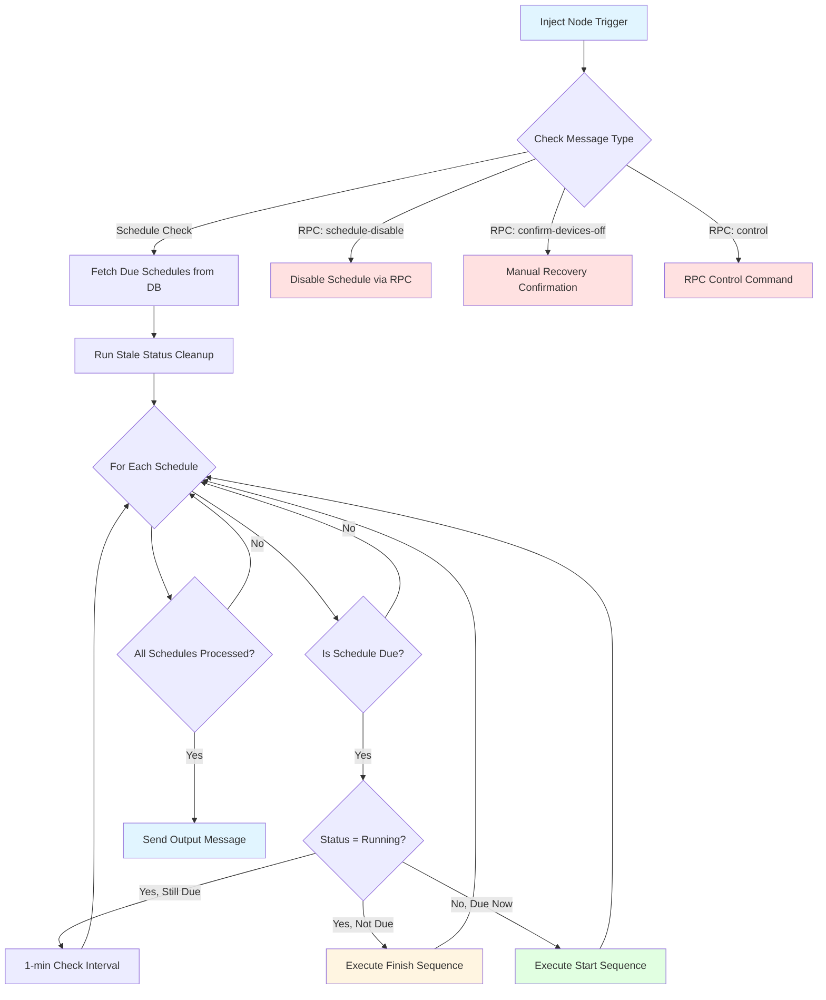

### Detailed Start Sequence

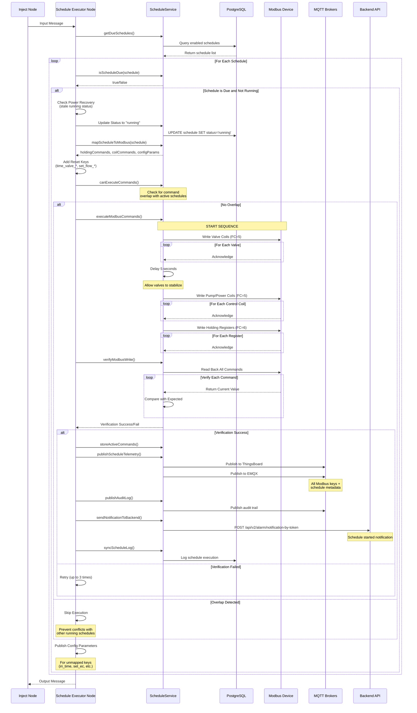

### Detailed Finish Sequence

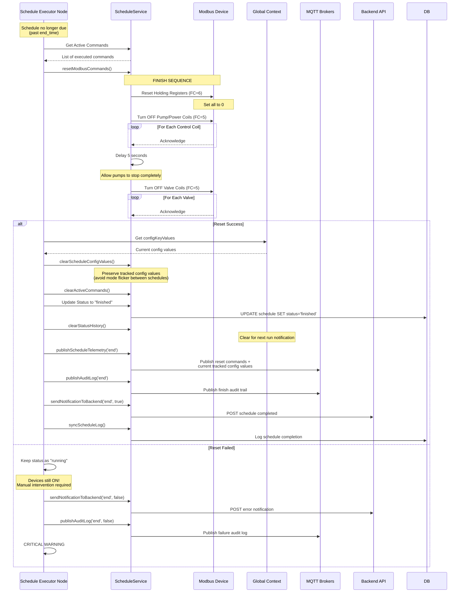

---

## Schedule Lifecycle

### State Machine

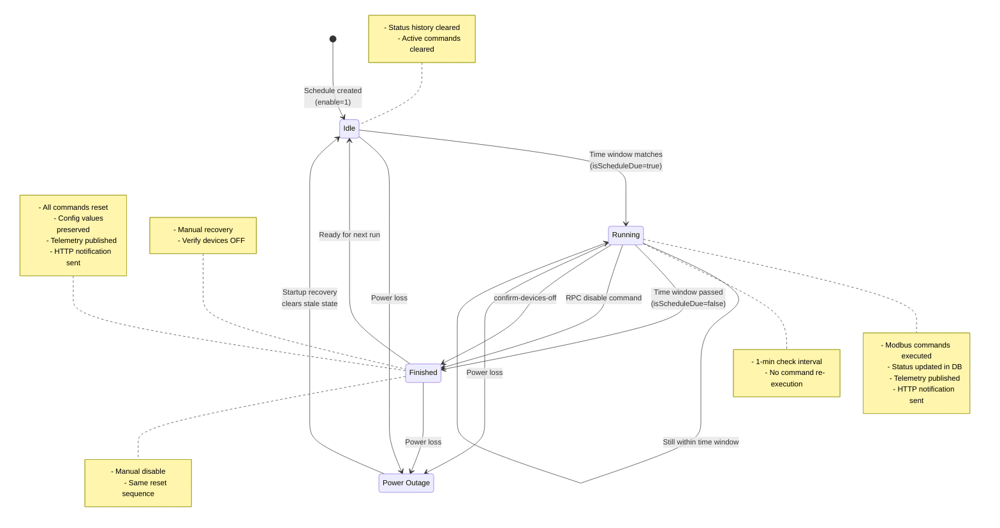

### Time Window Evaluation

The `isScheduleDue()` function performs these checks:

1. **Enabled Check**: `schedule.enable === 1`
2. **Date Range Check**: If `start_date` and `end_date` exist, current date must be within range
3. **Day of Week Check**: Parse `interval` field (0=Sunday, 1=Monday, ..., 6=Saturday)
   - Supports: single number `"3"`, comma-separated `"1,3,5"`, JSON array `"[1,3,5]"`
4. **Time Window Check**: Current time (UTC+7) must be between `start_time` and `end_time`
   - Handles **cross-midnight** scenarios (e.g., 23:00-02:00)
   - Uses **exclusive end boundary** `[start, end)` to prevent overlap

---

## Modbus Command Execution

### Command Mapping Process

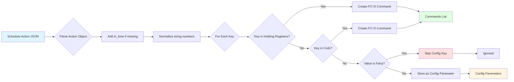

### Start vs Finish Execution Order

**START Sequence** (Devices ON):
```
1. Write all Holding Registers (FC=6)
   - time_valve_*, set_flow_*, etc.
   - Delay 100ms between writes

2. Write Valve Coils (FC=5)
   - Keys containing 'valve_'
   - Delay 100ms between writes

3. Write Other Coils (FC=5)
   - Not valve_, pump_, or power_

4. DELAY 5 SECONDS
   - Allow valves to fully open

5. Write Pump/Power Coils (FC=5)
   - Keys containing 'pump' or 'power'
   - Delay 100ms between writes
```

**FINISH Sequence** (Devices OFF - Reverse Order):
```
1. Turn OFF Pump/Power Coils (FC=5)
   - Stop pumps first
   - Delay 100ms between writes

2. Turn OFF Other Coils (FC=5)

3. DELAY 5 SECONDS
   - Allow pumps to stop completely

4. Turn OFF Valve Coils (FC=5)
   - Close valves after pumps stop
   - Delay 100ms between writes

5. Reset Holding Registers (FC=6)
   - Set all to 0
   - Delay 100ms between writes
```

**Rationale**: This sequence prevents water hammer and protects equipment by ensuring valves are fully open before pumps start, and pumps stop before valves close.

### Write Verification

After writing commands, the node **reads back** all values to verify:

- **Coils (FC=5)**: verified per key only when `skipCoilVerify = false`
- **Holding Registers (FC=6)**: verified per key only when `verifyAfterWrite = true` (default)
- **Scaling**: Read values are scaled back using the reverse operation (divide vs multiply)

If verification fails:
- That key is retried up to **3 times**; later keys still run
- **Start**: status stays `running`; one HTTP noti per failed key
- **Finish**: status still `finished`; one HTTP noti per failed key
- Lifecycle start/complete notifications stay one-per-transition

---

## MQTT Telemetry & Audit

### Telemetry Payload Format

**Start Action**:
```json
{
  "ts": 1712923200000,
  "_schedule_action": "start",
  "_schedule_id": "sch-irrigation-001",
  "_schedule_label": "Morning Irrigation",
  "pump_air": true,
  "valve_1": true,
  "valve_2": true,
  "set_ec": 2.5,
  "set_ph": 6.0,
  "time_valve_1": 1800,
  "user_id": 123
}
```

**Finish Action**:
```json
{
  "ts": 1712930400000,
  "_schedule_action": "end",
  "_schedule_id": "sch-irrigation-001",
  "_schedule_label": "Morning Irrigation",
  "pump_air": false,
  "valve_1": false,
  "valve_2": false,
  "set_ec": 0,
  "set_ph": 0,
  "time_valve_1": 0,
  "user_id": 0,
  "irrigation_mode": 0
}
```

### Telemetry Flow

```mermaid
graph TD
    A[Schedule Event] --> B{Event Type?}

    B -->|Start| C[Collect All Written Commands]
    B -->|Finish| D[Collect All Reset Commands]
    B -->|RPC Disable| D
    B -->|Manual Recovery| D

    C --> E[Add Schedule Metadata]
    D --> E

    E --> F{Config Values Provided?}
    F -->|Yes| G[Add Current Config Values]
    F -->|No| H[Skip Config]

    G --> I[Build Telemetry Object]
    H --> I

    I --> J{Deduplication Check}
    J -->|Same data < 5s| K[Skip Publish]
    J -->|New data or > 5s| L[Hash & Timestamp]

    L --> M[Publish to ThingsBoard]
    L --> N[Publish to EMQX]

    M --> O[v1/devices/me/telemetry]
    N --> P[viis/things/v2/{deviceId}/telemetry]

    O --> Q[Update Last Published]
    P --> Q

    style A fill:#e1f5ff
    style K fill:#ffe1e1
    style O fill:#e1ffe1
    style P fill:#e1ffe1
```

### Deduplication Logic

- **Key**: `telemetryLastPublished_{scheduleName}_{action}`
- **Hash**: JSON.stringify of all keys except `ts`
- **Timeout**: 5 seconds
- **Per-schedule and per-action**: Start and end tracked independently

**Purpose**: Prevents duplicate telemetry from retry logic or multiple trigger sources.

### Audit Log Format

```json
{
  "logs": {
    "from": "DEVICE_EXE_SCHEDULE",
    "requestId": "uuid-v4-string",
    "message": "Lịch trình \"Morning Irrigation\" bắt đầu: valve_1=true, pump_air=true",
    "metadata": {
      "status": "SUCCESS",
      "schedule_id": "sch-irrigation-001",
      "schedule_label": "Morning Irrigation",
      "action": "start",
      "changed_keys": [
        {
          "key": "valve_1",
          "value": true,
          "address": 10,
          "fc": 5
        },
        {
          "key": "pump_air",
          "value": true,
          "address": 15,
          "fc": 5
        }
      ],
      "timestamp": 1712923200000,
      "error": null
    }
  }
}
```

---

## RPC Control Commands

### 1. `schedule-disable-by-backend`

**Purpose**: Remotely disable a running schedule via ThingsBoard RPC

**Payload**:
```json
{
  "method": "schedule-disable-by-backend",
  "params": {
    "scheduleId": "sch-irrigation-001"
  }
}
```

**Flow**:
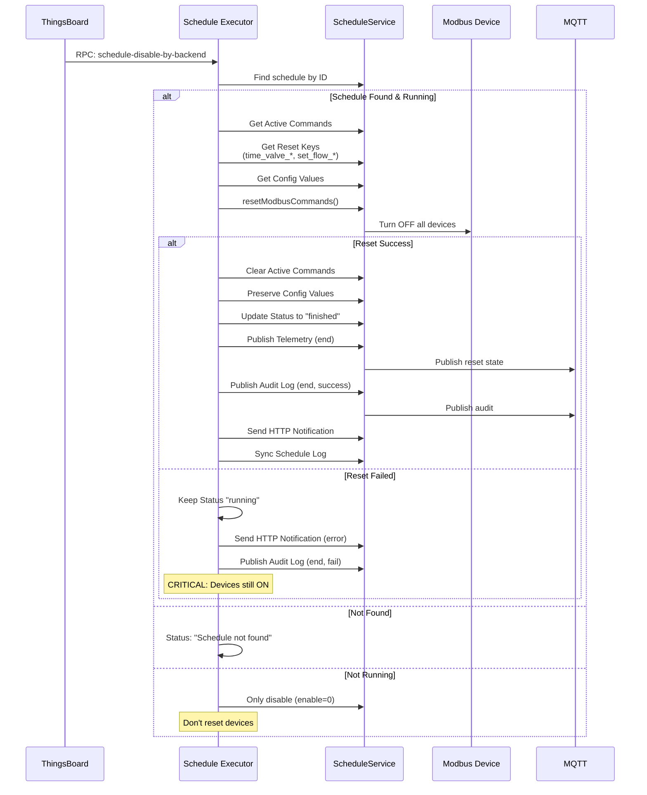

### 2. `confirm-devices-off`

**Purpose**: Manual recovery after devices are stuck in "running" state

**Payload**:
```json
{
  "method": "confirm-devices-off",
  "params": {
    "scheduleId": "sch-irrigation-001",
    "verifyDevices": true
  }
}
```

**Flow**:
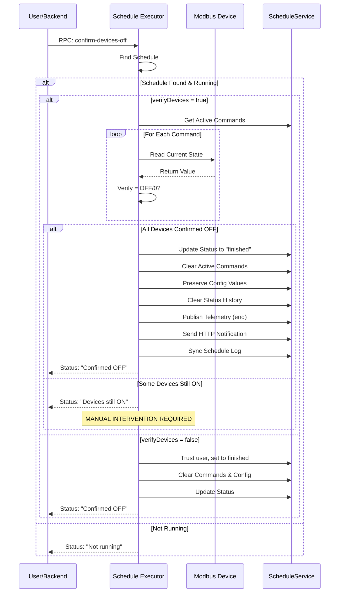

### 3. `control` (General RPC Control)

**Purpose**: Remotely update configuration parameters or control Modbus devices

**Payload**:
```json
{
  "method": "control",
  "params": {
    "scheduleId": "any",
    "irrigation_mode": "drip",
    "set_ec": 2.5,
    "user_id": 456
  }
}
```

**Processing**:
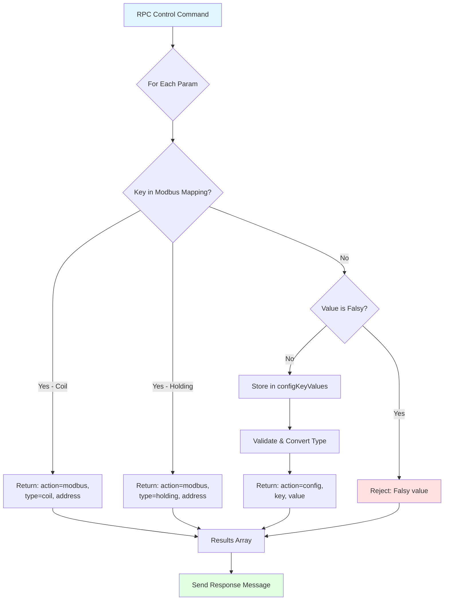

---

## Error Handling & Recovery

### Startup Recovery (Power Cycle)

When the node starts, it detects potential stale state from power outage:

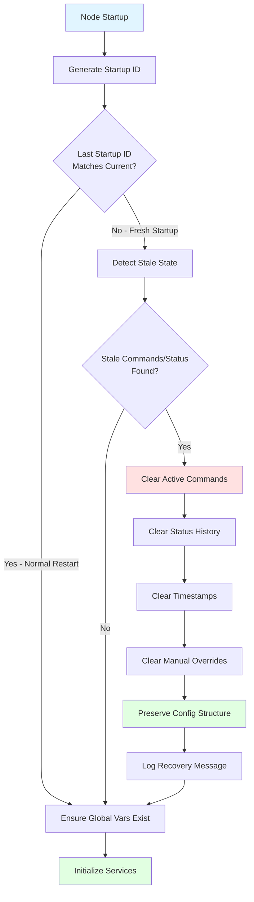

**What gets cleared**:
- `activeModbusCommands` - Prevents stuck schedules
- `scheduleStatusHistory` - Fresh status tracking
- `scheduleLastCheckTimestamps` - Fresh timestamps
- `manualModbusOverrides` - Fresh overrides

**What is preserved**:
- `configKeyValues` - Configuration structure maintained
- `scheduleConfigKeys` - Key tracking preserved

### Stale Status History Cleanup

Runs periodically (default: every 15 minutes) to clean stuck "running" entries:

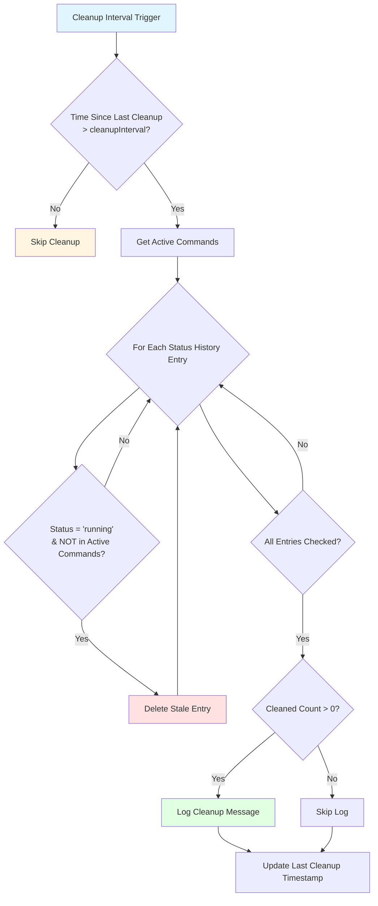

### Power Outage Recovery (Schedule Level)

Detects schedules marked "running" but with no active commands:

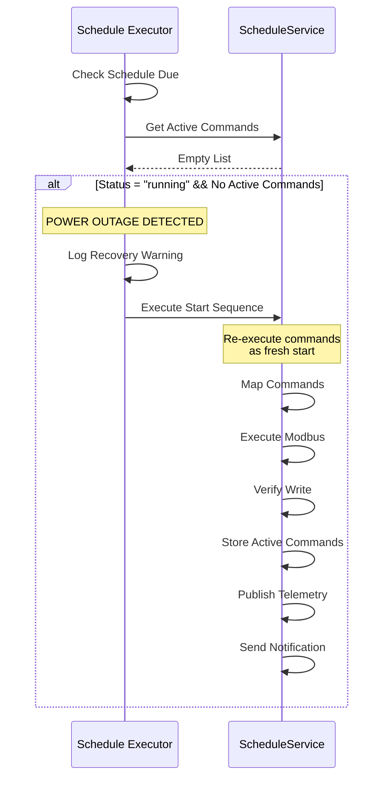

### Command Overlap Prevention

Prevents two schedules from writing to the same Modbus address:

```mermaid
graph TD
    A[Schedule Ready to Execute] --> B[Get Commands to Execute]
    B --> C[Get Active Commands from Context]

    C --> D{For Each New Command}
    D --> E{Skip Config Keys?<br/>(CONFIG_PARAMETER_KEYS)}

    E -->|Yes| F[Skip Overlap Check]
    E -->|No| G{Check Active Schedules}

    G --> H{For Each Active Schedule}
    H --> I{Same Schedule ID?}

    I -->|Yes| H
    I -->|No| J{Same Address &&<br/>Same Function Code?}

    J -->|Yes| K[OVERLAP DETECTED]
    J -->|No| H

    H --> L{All Active Schedules<br/>Checked?}
    L -->|No| H
    L -->|Yes| M[No Overlap]

    K --> N[SKIP EXECUTION]
    M --> O[EXECUTE COMMANDS]
    F --> M

    style A fill:#e1f5ff
    style K fill:#ffe1e1
    style N fill:#ffe1e1
    style O fill:#e1ffe1
```

---

## Resilience Patterns

### Timeout Protection

```typescript
executeWithTimeout<T>(
  operation: () => Promise<T>,
  timeoutMs: number,
  timeoutMessage?: string
): Promise<T>
```

- Uses `Promise.race()` to enforce timeout
- Prevents hanging operations
- Customizable timeout message

### Exponential Backoff Retry

```typescript
executeWithExponentialBackoff<T>(
  operation: () => Promise<T>,
  maxRetries: number,
  baseDelay: number,
  maxDelay: number = 30000,
  useJitter: boolean = false
): Promise<T>
```

- **Formula**: `delay = baseDelay × 2^attempt`
- **Capped** at `maxDelay` (default: 30s)
- **Optional jitter**: ±25% random variation to prevent thundering herd

### Circuit Breaker

```typescript
executeWithCircuitBreaker<T>(
  operation: () => Promise<T>,
  circuitKey: string,
  options: CircuitBreakerOptions
): Promise<T>
```

**States**:
1. **Closed** (Normal): Allow requests
2. **Open** (Tripped): Reject requests after `failureThreshold` failures
3. **Half-Open** (Testing): Allow one test request after `resetTimeout`

**State Transitions**:
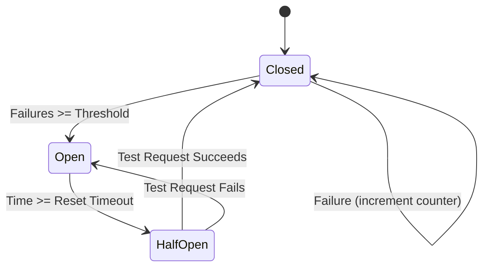

### Combined Resilience

```typescript
executeWithResilience<T>(
  operation: () => Promise<T>,
  options: ResilienceOptions
): Promise<T>
```

Combines all three patterns:
1. Check circuit breaker state
2. Execute with timeout
3. Retry with exponential backoff
4. Update circuit breaker on success/failure

### MQTT Failed Queue

```typescript
class MqttFailedQueue {
  add(item: MqttQueueItem): void
  getAll(): MqttQueueItem[]
  remove(index: number): void
  processFailedMqttQueue(): void
}
```

- Stores failed MQTT notifications
- Max queue size: 100 items
- Automatic retry with reduced retries
- Removes items after 5 failed attempts

---

## Global Context Management

The node uses Node-RED global context to persist state across executions:

### Context Variables

| Variable | Type | Purpose |
|----------|------|---------|
| `activeModbusCommands` | `{[scheduleId: string]: ModbusCmd[]}` | Track currently executing commands per schedule |
| `manualModbusOverrides` | `{[key: string]: {fc, value, timestamp}}` | Manual overrides for individual Modbus keys |
| `scheduleStatusHistory` | `{[scheduleId: string]: string}` | Track status changes for notification triggers |
| `scheduleLastCheckTimestamps` | `{[scheduleId: string]: number}` | Track last check time for running schedules |
| `configKeyValues` | `{[key: string]: any}` | Store configuration parameters from schedules/RPC |
| `scheduleConfigKeys` | `{[scheduleId: string]: string[]}` | Track which config keys belong to which schedule |
| `scheduleExecutorStartupId` | `string` | Detect startup/restart for recovery |
| `scheduleExecutorStartupTime` | `number` | Timestamp of last startup |
| `scheduleStatusHistoryLastCleanup` | `number` | Timestamp of last stale status cleanup |
| `telemetryLastPublished_{name}_{action}` | `{hash: string, timestamp: number}` | Deduplication tracking per schedule |

### Configuration Flow

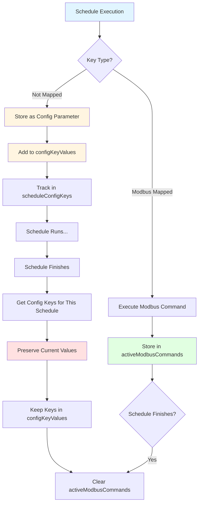

**Key Design Decision**: Config keys are **preserved** and **not removed** at schedule finish. This avoids temporary mode flicker between schedules.

---

## Data Flow Diagrams

### Complete Schedule Execution

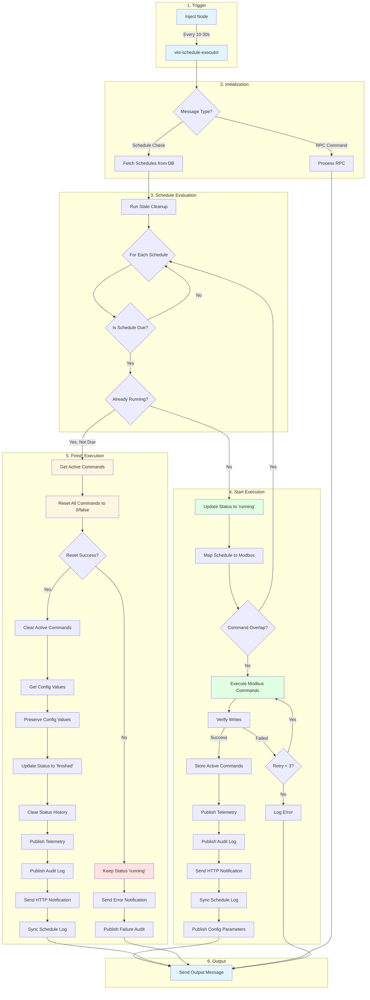

### Modbus Write & Verification Flow

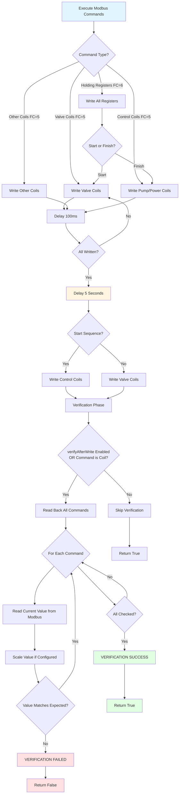

### Configuration Parameter Flow

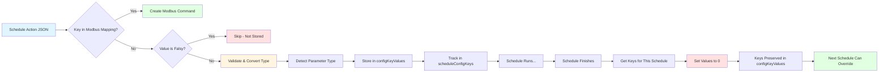

---

## Configuration Parameters

### Node Configuration

| Property | Type | Default | Description |
|----------|------|---------|-------------|
| `name` | string | `""` | Node display name |
| `description` | string | `""` | Optional description |
| `debugEnable` | boolean | `false` | Enable detailed debug logging |
| `verifyAfterWrite` | boolean | `true` | Verify holding registers after write |
| `cleanupInterval` | number | `15` | Minutes between stale status cleanup |

### Environment Variables

| Variable | Purpose | Example |
|----------|---------|---------|
| `DEVICE_ID` | Device identifier | `"device-001"` |
| `MODBUS_BOARDS` | Multi-board configuration | JSON array of board configs |
| `MODBUS_HOST` | Modbus TCP host | `"modbus-server"` |
| `MODBUS_TCP_PORT` | Modbus TCP port | `502` |
| `THINGSBOARD_HOST` | ThingsBoard MQTT broker | `"mqtt.viis.tech"` |
| `THINGSBOARD_PORT` | ThingsBoard MQTT port | `"1883"` |
| `DEVICE_ACCESS_TOKEN` | ThingsBoard auth token | `"abc123..."` |
| `EMQX_HOST` | Local MQTT broker | `"emqx"` |
| `EMQX_PORT` | Local MQTT port | `"1883"` |
| `VIIS_BACKEND` | Backend API URL | `"http://backend:3000"` |
| `MODBUS_COILS` | Legacy coil mappings | JSON object |
| `MODBUS_HOLDING_REGISTERS` | Legacy register mappings | JSON object |
| `MODBUS_MAX_RETRIES` | Max retry attempts | `3` |

---

## Key Design Decisions

### 1. **Reverse Order for Start/Finish**
- **Start**: Valves ON → Delay → Pumps ON
- **Finish**: Pumps OFF → Delay → Valves OFF
- **Why**: Prevents water hammer and protects equipment

### 2. **Config Values Preserved, Not Deleted**
- Config keys and values are preserved at schedule finish
- **Why**: Prevents transient mode flicker and preserves continuity across schedules

### 3. **Dual MQTT Publishing**
- Publishes to both ThingsBoard and EMQX
- **Why**: Redundancy and local/remote monitoring

### 4. **Verification Always for Coils**
- Coils verified regardless of `verifyAfterWrite` setting
- **Why**: Coils control critical devices (valves, pumps)

### 5. **Always Finish Regardless of Modbus Success**
- Status ALWAYS set to "finished" when schedule execution completes (success OR failure)
- Error notifications sent ONCE when failure occurs (guarded by `statusChanged` check)
- **Why**: Prevents stuck "running" status and notification spam on every trigger

### 6. **Status History for Notification Trigger**
- Notifications only sent on status change
- **Why**: Prevents duplicate notifications during continuous running

### 7. **Graceful Degradation**
- MQTT failures don't break schedule execution
- **Why**: Local Modbus control is more critical than remote monitoring

### 8. **Command Overlap Prevention**
- Schedules with conflicting Modbus addresses blocked
- **Why**: Prevents race conditions and device conflicts

---

## Troubleshooting

### Common Issues

| Symptom | Cause | Solution |
|---------|-------|----------|
| No output, status "No active trip" | No schedule in time window | Check schedule time and enable status |
| Schedule stuck as "running" | Power outage (auto-recovers on next trigger) | Wait or use `confirm-devices-off` RPC |
| Verification failed warnings | Modbus write failure or scaling issue | Check device connection and scale configs |
| Command overlap detected | Two schedules using same address | Modify schedule actions to avoid conflicts |
| MQTT publish errors | Broker connection issue | Check MQTT broker status and credentials |
| Schedule not executing | Date range or day of week mismatch | Check `start_date`, `end_date`, and `interval` |
| Error notification spam | **FIXED** - Status now always set to "finished" | Update to latest version |

### Debug Mode

Enable `debugEnable` in node configuration to see:
- Schedule due checks
- Modbus read/write operations
- MQTT publish attempts
- Verification results
- Config parameter storage
- Cleanup operations

### Log Patterns

**Successful Start**:
```
▶️ STATUS CHANGE: sch-001 | none → running | Label: Morning Irrigation
🔧 MODBUS START SEQUENCE: sch-001
  ├─ Step 1: Writing 3 VALVE coils
  ├─ Step 2: Delay 5 seconds
  └─ Step 3: Writing 2 PUMP/POWER coils
🔍 VERIFYING COILS: 5 commands (always verified)
✅ VERIFICATION SUCCESS: 5 commands verified (5 coils, 3 holding registers)
📊 SCHEDULE TELEMETRY: sch-001 | Action: start | Keys: 8 Modbus + 2 Config = 10 total
📝 AUDIT LOG PUBLISHED: sch-001 | Action: start | Keys: 8 | Status: SUCCESS
📡 HTTP NOTIFICATION SENT: sch-001 | Action: start | Status: Pending
```

**Failed Finish**:
```
⏹️ STATUS CHANGE: sch-001 | running → finished | Label: Morning Irrigation
🛑 MODBUS FINISH SEQUENCE: sch-001
  ├─ Step 1: Turning OFF 2 PUMP/POWER coils
  ├─ Step 2: Delay 5 seconds
  └─ Step 3: Closing 3 VALVE coils
❌ MODBUS ERROR: sch-001 | Failed to write coil pump_air at 15 | Timeout
⚠️ CRITICAL: Reset failed for sch-001 - keeping status as "running"
🚨 CRITICAL: sch-001 cannot turn off devices - MANUAL INTERVENTION REQUIRED
```

---

## Testing

### Unit Tests
Located in `tests/` directory:
- Schedule due checks
- Modbus command mapping
- Write verification
- Telemetry deduplication
- Config parameter handling
- RPC command processing

### Manual Testing

1. **Trigger Schedule Execution**:
```javascript
// Inject node with empty message
msg = {}
```

2. **Test RPC Disable**:
```javascript
msg = {
  payload: {
    method: "schedule-disable-by-backend",
    params: {
      scheduleId: "sch-test-001"
    }
  }
}
```

3. **Test Manual Recovery**:
```javascript
msg = {
  payload: {
    method: "confirm-devices-off",
    params: {
      scheduleId: "sch-test-001",
      verifyDevices: true
    }
  }
}
```

4. **Test RPC Control**:
```javascript
msg = {
  payload: {
    method: "control",
    params: {
      scheduleId: "any",
      irrigation_mode: "drip",
      set_ec: 2.5
    }
  }
}
```

---

## Performance Considerations

### Database Queries
- Schedules fetched once per trigger
- TypeORM connection reused (check `AppDataSource.isInitialized`)
- Status updates synced to server after local DB update

### Modbus Operations
- 100ms delay between commands (prevents bus saturation)
- 5s delay between valve and pump operations (equipment protection)
- Verification doubles Modbus traffic (read after write)

### MQTT Publishing
- Deduplication prevents redundant publishes (5s window)
- Both brokers published independently (partial success possible)
- Failed messages queued for retry

### Memory Usage
- Global context stores active commands and config
- Stale cleanup prevents memory leaks
- Config key tracking grows with unique parameters

---

## Future Enhancements

1. **Dynamic Interval Adjustment**: Adjust check frequency based on schedule density
2. **Predictive Start**: Pre-start schedules before time window (warm-up)
3. **Modbus Transaction Groups**: Batch commands by address range
4. **Advanced Circuit Breakers**: Per-device circuit breakers
5. **Schedule Priority**: High-priority schedules can override lower priority
6. **Telemetry Compression**: Delta-based telemetry (only changed keys)
7. **Multi-Device Support**: Execute schedules across multiple devices
8. **Schedule Templates**: Reusable schedule patterns

---

## Appendix A: Entity Relationships

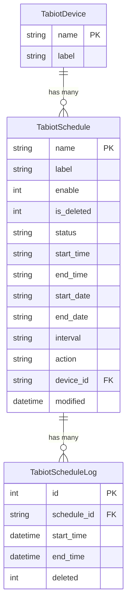

---

## Appendix B: Scale Configuration

Scale configs transform raw Modbus values to/from engineering units:

```typescript
interface ScaleConfig {
  key: string;           // Modbus key name
  operation: 'multiply' | 'divide';
  factor: number;
  direction: 'read' | 'write';
}
```

**Example**:
```json
[
  {
    "key": "set_ec",
    "operation": "divide",
    "factor": 10,
    "direction": "write"  // 2.5 → 25 (raw Modbus value)
  },
  {
    "key": "set_ec",
    "operation": "multiply",
    "factor": 10,
    "direction": "read"   // 25 → 2.5 (engineering value)
  }
]
```

---

## Appendix C: Config Parameter Keys (No Overlap Check)

These keys are treated as configuration parameters and skip command overlap checking:

```
iri_time, set_ec, set_ph, control_mode, iri_sensor_mode,
water_only_time, cycle_ec, cycle_ph,
time_on_valve_01 through time_on_valve_05,
set_flow, set_flow_1 through set_flow_5,
volume_factor_01 through volume_factor_05, volume_factor_main,
flow_factor_01 through flow_factor_05, flow_factor_main,
pressure_div_factor, pressure_sub_factor,
min_pressure_limit, max_pressure_limit,
EC_max, EC_min
```

---

*Documentation generated on April 13, 2026*
*For questions or issues, refer to README files in module root or contact VIIS development team*
